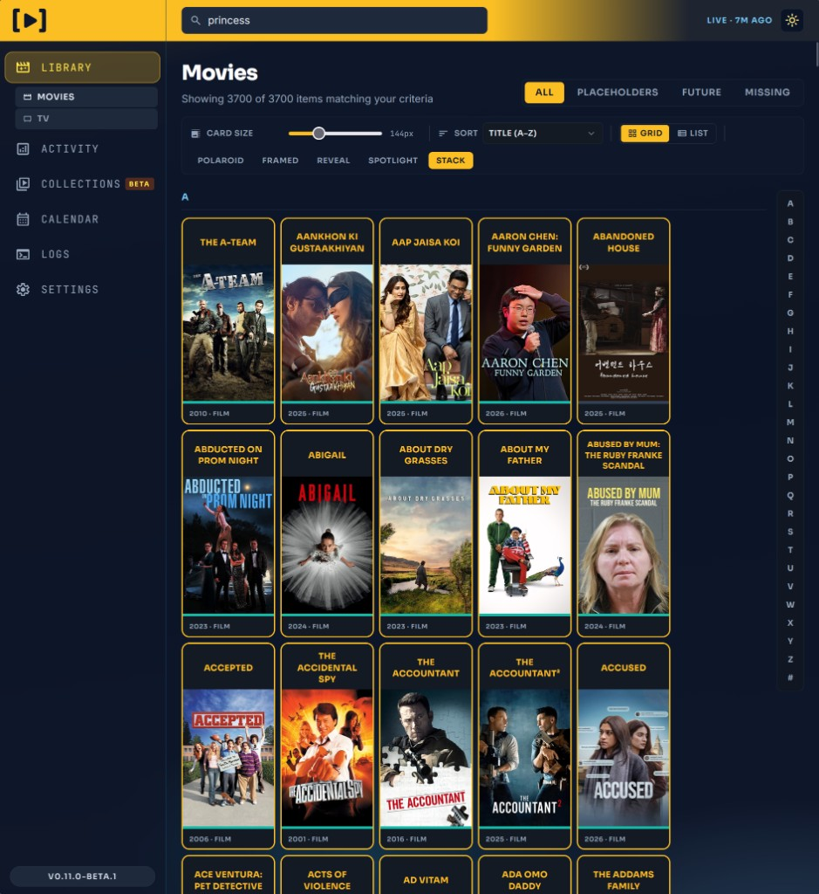
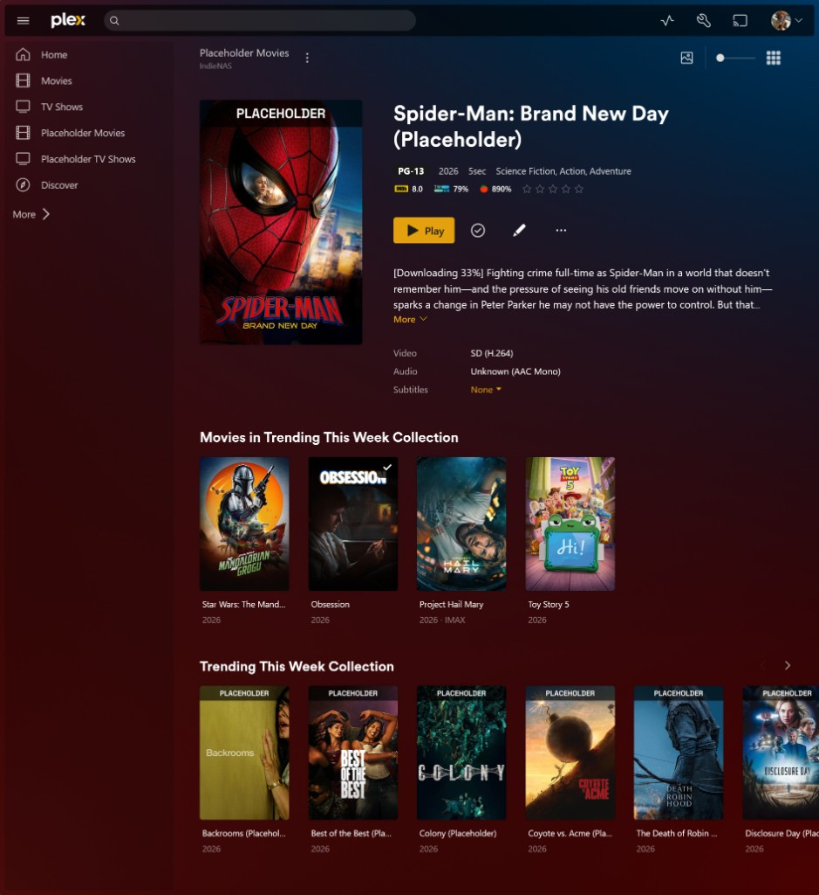
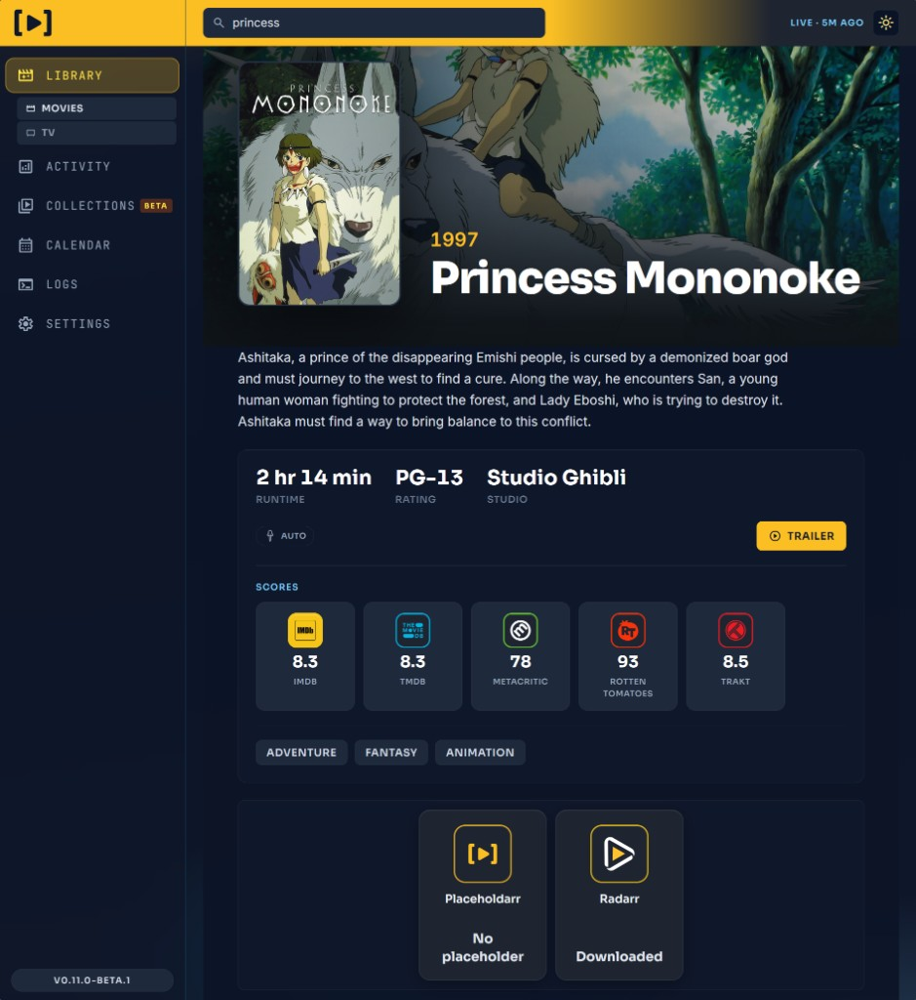
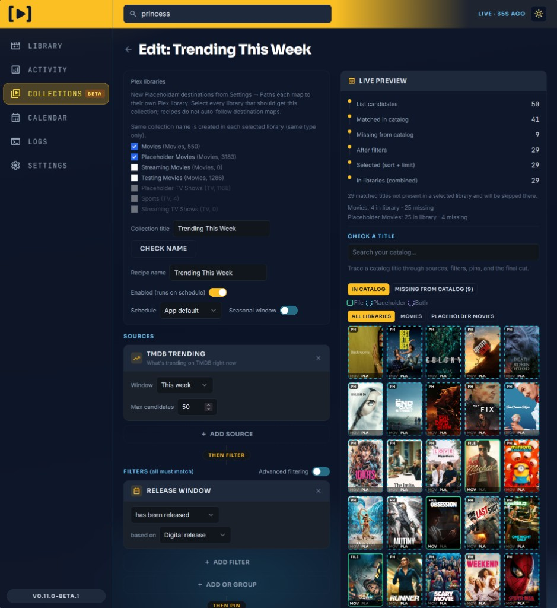

<p align="center">
  
</p>

<h1 align="center">Placeholdarr</h1>

<p align="center">
  <strong>Your whole catalog. On demand.</strong><br />
  Keep movies and shows visible across the three major media servers without filling every disk first.
</p>

<p align="center">
  <a href="https://github.com/TheIndieArmy/placeholdarr/pkgs/container/placeholdarr"></a>
  <a href="CHANGELOG.md"></a>
</p>

---

Placeholdarr sits between your Arr stack and your media server. It puts lightweight placeholders into your libraries so titles stay browseable, searchable, and playable to request. When someone hits play, Placeholdarr asks Radarr or Sonarr to find the real file. When the download lands, the placeholder steps aside.

You get the feeling of a deep, complete library. Storage stays tied to what people actually watch.

Placeholdarr is AI-developed, and we are open about that. TheIndieArmy designs and maintains it.

## See it in action

<p align="center">
  
  &nbsp;
  
  &nbsp;
  
  &nbsp;
  
</p>

## What it makes possible

**Browse first, download when it matters.**  
Friends and family see the catalog in the client they already use. When they play a placeholder, Placeholdarr asks Arr to find the real file.

**Spend disk on demand.**  
Add lists to Radarr and Sonarr unmonitored and let Placeholdarr take it from there. Your library sees more. Your storage sees less.

**Fit real Arr setups.**  
Multiple Radarr and Sonarr instances, multiple library destinations, and support for the three major media servers.

**Stay in control of TV footprint.**  
Choose how dense TV placeholders should be: one file per episode, per season, or per series. Pair that with search mode and lookahead so play requests behave the way you want for your setup.

**Show titles before they release.**  
Coming Soon placeholders put unreleased movies and episodes in media players early, with a countdown to the release date so people can see what is on the way.

**Make placeholders easy to spot.**  
Placeholdarr supports separate placeholder libraries, poster overlays, and automated metadata updates so it is clear what is a placeholder and what is real media.

**Make the library feel intentional.**  
Status and download progress show up in the player, cleanup runs when real media lands, and living Plex collections stay current without hand-editing membership every week.

## Quick start

```bash
# Use the compose file in this repo, then open the WebUI and finish onboarding.
docker compose up -d
```

Image: `ghcr.io/theindiearmy/placeholdarr:latest`  
Prefer a pinned version from the [package page](https://github.com/TheIndieArmy/placeholdarr/pkgs/container/placeholdarr) when you want a specific release.

## Learn more

- [Changelog](CHANGELOG.md) for what shipped in each release
- [docker-compose.yml](docker-compose.yml) for a ready stack with Postgres

## Credits

Inspired by [Infinite Plex Library](https://github.com/arjanterheegde/infiniteplexlibrary) and [Chronicle](https://github.com/iwouldratherbeatthebeach/chronicle).

- Jellyfin support and database foundation: [Priky-one](https://github.com/Priky-one)
- GHCR workflow: [aves-omni](https://github.com/aves-omni)

Maintained by [TheIndieArmy](https://github.com/TheIndieArmy).
